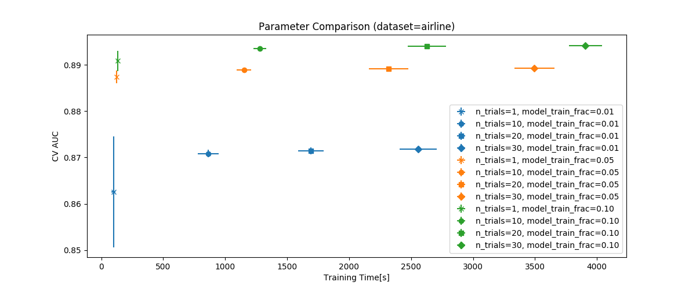
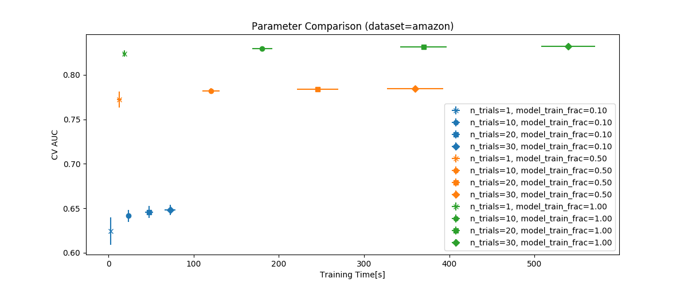
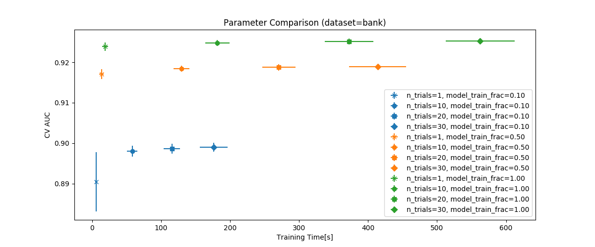

## About

This is an experimental Python package that reimplements [AutoGBT](https://github.com/flytxtds/AutoGBT) using [LightGBM](https://github.com/Microsoft/LightGBM) and [Optuna](https://github.com/pfnet/optuna/). AutoGBT is an automatically tuned machine learning classifier which won the first prize at [NeurIPS'18 AutoML Challenge](https://competitions.codalab.org/competitions/19836). AutoGBT has the following features:

* Automatic Hyperparameter Tuning: the hyperparameters of LightGBM are automatically optimized,
* Automatic Feature Engineering: simple feature engineering is applied for categorical and datetime features, and
* Automatic Sampling: data rows are sampled for handling imbalanced and large datasets.

This implementation has the following differences from original AutoGBT:

1. This implementation uses Optuna for the hyperparameter tuning of LightGBM instead of [Hyperopt](https://github.com/hyperopt/hyperopt),
1. it optimizes k-fold cross-validation AUC score, and
1. it equips simplified scikit-learn-like API interface.

## Installation

```
$ pip install git+https://github.com/pfnet-research/autogbt-alt.git
```
or
```
$ pip install git+ssh://git@github.com/pfnet-research/autogbt-alt.git
```

## Usage

### Basic Usage: LightGBM with Automatic Hyperparameter Tuning

```python3
from sklearn.datasets import load_breast_cancer
from sklearn.model_selection import train_test_split
from sklearn.metrics import roc_auc_score
from autogbt import AutoGBTClassifier

X, y = load_breast_cancer(return_X_y=True)
train_X, valid_X, train_y, valid_y = train_test_split(X, y, test_size=0.1)
model = AutoGBTClassifier()
model.fit(train_X, train_y)
print('valid AUC: %.3f' % (roc_auc_score(valid_y, model.predict(valid_X))))
print('CV AUC: %.3f' % (model.best_score))
```

### Feature Engineering

```python3
from autogbt import Preprocessor

preprocessor = Preprocessor(train_frac=0.5, test_frac=0.5)
train_X, valid_X, train_y = preprocessor.transform(train_X, valid_X, train_y)
```

### Training with Sampling

```python3
from autogbt import TrainDataSampler

sampler = TrainDataSampler(train_frac=0.5, valid_frac=0.5)
model = AutoGBTClassifier(sampler=sampler)
model.fit(train_X, train_y)
model.predict(test_X)
```

## Experimental Evaluation

Please see `benchmark` directory for the details.

### Comparison against Vanilla XGBoost and LightGBM

The default values are used for all hyperparameters of AutoGBT, XGBoost and LightGBM.

#### [Airline Dataset](https://www.openml.org/d/1240)

| model    | duration[s]      | CV AUC      |
|:---------|:-----------------|:------------|
| AutoGBT  | 6515.254±340.231 | 0.900±0.001 |
| Xgboost  | 78.561±7.265     | 0.872±0.000 |
| LightGBM | 34.000±2.285     | 0.891±0.000 |

#### [Amazon Challenge](https://www.kaggle.com/c/amazon-employee-access-challenge)

| model    | duration[s]    | CV AUC      |
|:---------|:---------------|:------------|
| AutoGBT  | 359.834±29.188 | 0.832±0.002 |
| Xgboost  | 2.558±0.661    | 0.749±0.002 |
| LightGBM | 1.789±0.165    | 0.834±0.002 |

#### [Avazu CTR Prediction](https://www.kaggle.com/c/avazu-ctr-prediction)

| model    | duration[s]       | CV AUC      |
|:---------|:------------------|:------------|
| AutoGBT  | 20322.601±676.702 | 0.744±0.000 |
| Xgboost  | OoM               | OoM         |
| LightGBM | OoM               | OoM         |

#### [Bank Marketing Data Set](https://archive.ics.uci.edu/ml/datasets/bank+marketing)

| model    | duration[s]    | CV AUC      |
|:---------|:---------------|:------------|
| AutoGBT  | 372.090±32.857 | 0.925±0.001 |
| Xgboost  | 2.683±0.204    | 0.912±0.001 |
| LightGBM | 2.406±0.236    | 0.927±0.001 |

### Parameter Comparison

Performance on various `train_frac` and `n_trials` parameters





## Testing

```
$ ./test.sh
```

## Reference

Jobin Wilson and Amit Kumar Meher and Bivin Vinodkumar Bindu and Manoj Sharma and Vishakha Pareek and Santanu Chaudhury and Brejesh Lall, **AutoGBT: Automatically Optimized Gradient Boosting Trees for Classifying Large Volume High Cardinality Data Streams under Concept-Drift,** 2018, https://github.com/flytxtds/AutoGBT.

